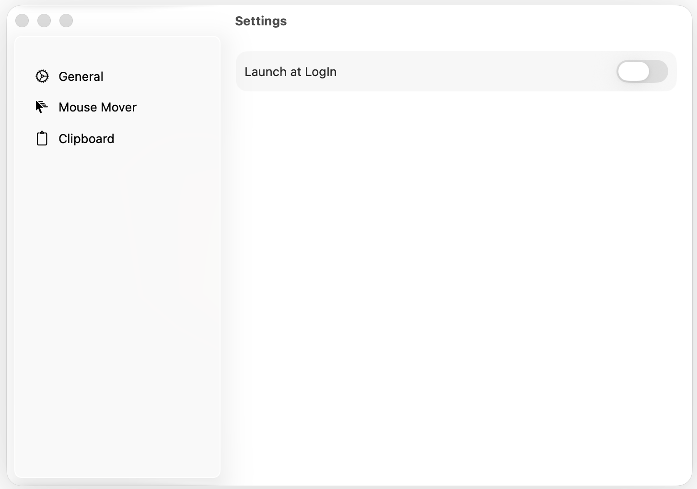

# TestSplitView 🚀

TestSplitView is a small macOS menu bar app with a native-style settings experience built around `NavigationSplitView`. The sidebar contains the main sections, and the detail pane shows the selected settings view.

## Features ✨

- Menu bar app with quick access to core actions
- Native macOS split-view settings layout
- Launch-at-login toggle in the General section
- Mouse Mover section with a time-span table and add/remove controls
- Clipboard section for clipboard-related behavior

## Screenshot 📸

## Getting Started 🛠️

1. Open `TestSplitView.xcodeproj` in Xcode.
2. Select a macOS run destination.
3. Build and run the app.

## Project Structure 📁

- `TestSplitView/SettingSplitView.swift` - settings UI and section views
- `TestSplitView/TestSplitViewApp.swift` - app entry point and menu bar UI
- `TestSplitView/AppSettings.swift` - app state and settings logic

## Notes 📝

The UI is intentionally compact and follows the look and feel of native macOS settings.
